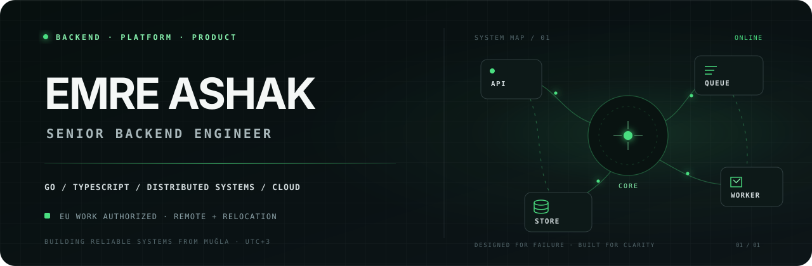

  

 

  <strong>Senior backend engineer turning complex systems into reliable products.</strong> 
  Backend services · platform engineering · commerce integrations · developer tools

  <a href="https://emre.zip"><strong>Portfolio</strong></a>
  &nbsp;·&nbsp;
  <a href="https://emre.zip/Emre-Ashak-CV.pdf"><strong>CV</strong></a>
  &nbsp;·&nbsp;
  <a href="https://emreisik.dev"><strong>Writing</strong></a>
  &nbsp;·&nbsp;
  <a href="https://www.linkedin.com/in/emreashak"><strong>LinkedIn</strong></a>
  &nbsp;·&nbsp;
  <a href="mailto:hello@emreisik.dev"><strong>Email</strong></a>

---

## Engineering, end to end

I'm **Emre Ashak (Emre Işık)**, a software engineer at **Insider** focused on backend and platform engineering. I work where product requirements meet production constraints: service boundaries, data flows, integrations, infrastructure, and the failure modes between them.

I like systems that are easy to reason about, observable in production, and deliberately simpler than the problem they solve.

<table>
  <tr>
    <td width="33%" valign="top">
      <strong>Backend systems</strong>  
      APIs, asynchronous processing, event-driven workflows, and services designed around clear ownership.
    </td>
    <td width="33%" valign="top">
      <strong>Platform &amp; reliability</strong>  
      Cloud infrastructure, observability, deployment paths, and operationally boring software.
    </td>
    <td width="34%" valign="top">
      <strong>Commerce engineering</strong>  
      Multi-tenant integrations and the backend plumbing that keeps products and platforms in sync.
    </td>
  </tr>
</table>

## Selected work

<table>
  <tr>
    <td width="33%" valign="top">
      <h3><a href="https://github.com/emreisik95/sendthen">sendthen ↗</a></h3>
      
Open-source, self-hosted email infrastructure with a Resend-compatible API, DKIM signing, webhooks, broadcasts, and inbound email.

      
<code>TypeScript</code> <code>SQLite</code> <code>Docker</code>

    </td>
    <td width="33%" valign="top">
      <h3><a href="https://download.fyi">Download.fyi ↗</a></h3>
      
Encrypted browser-to-browser file transfer built around WebRTC and client-side encryption, with no server in the data path.

      
<code>Next.js</code> <code>WebRTC</code> <code>WebSockets</code>

    </td>
    <td width="34%" valign="top">
      <h3><a href="https://github.com/emreisik95/wattmeter">Wattmeter ↗</a></h3>
      
A native macOS menubar app that turns local Claude Code and Codex CLI session data into useful, private usage insights.

      
<code>Swift</code> <code>SwiftUI</code> <code>AppKit</code>

    </td>
  </tr>
</table>

<a href="https://emre.zip"><strong>Explore more work →</strong></a>

## Engineering focus

| | |
|---|---|
| **Core** | Go, TypeScript, Node.js, PHP |
| **Systems** | Distributed systems, REST and GraphQL APIs, asynchronous jobs, webhooks, multi-tenant architecture |
| **Infrastructure** | AWS, Cloudflare, Docker, Kubernetes, Terraform |
| **Data** | MySQL, Redis, SQLite |

## How I work

- **Start with the pressure points.** Understand the constraints and failure modes before drawing service boundaries.
- **Keep complexity on a budget.** Architecture should make the system easier to change, not more impressive to explain.
- **Design for the person on call.** Observable behavior and predictable recovery paths are product features.
- **Own the whole outcome.** Move comfortably from product conversation to implementation, deployment, and iteration.

---

## Looking for the next hard problem

I'm open to **senior backend and platform engineering roles across Europe** — remote or relocation. I'm an **EU citizen**, so no sponsorship is required.

If you're building infrastructure, commerce platforms, developer tools, or a product with genuinely difficult backend problems, I'd like to hear about it.

  <a href="mailto:hello@emreisik.dev"><strong>hello@emreisik.dev</strong></a>
  &nbsp;·&nbsp;
  Muğla, Türkiye · UTC+3

